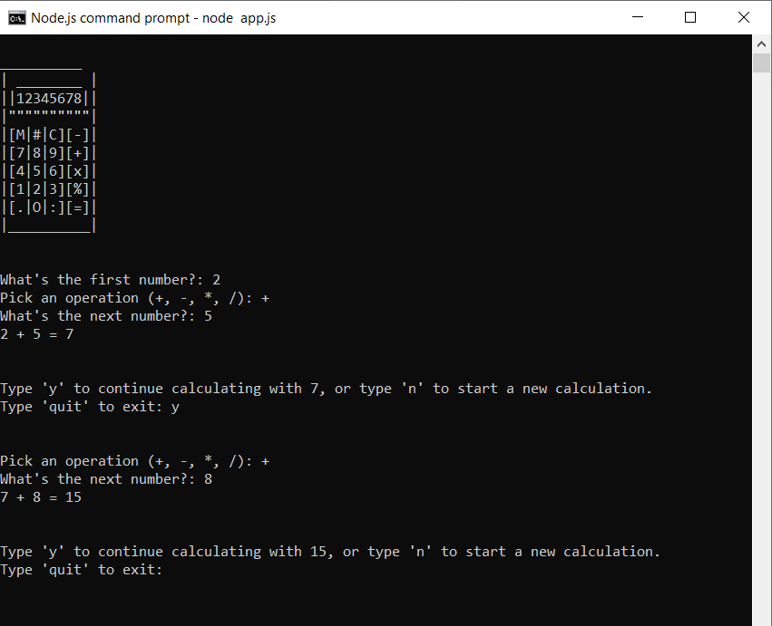

# 100 Days of Code - Day 10 - Calculator

# Prompt

Write a progam that has the following console features:

* Display a calculator-related ASCII art
* Ask the user for a number.
* Ask the user to pick an operation: +, -, *, /
* Ask the user to enter another number
* Ask the user to continue with calculated number or a new calculatation
* Ask the user if they want to quit.
* if the user continues with calculated number, use that as the first number

# Example

CALCULATOR

What's the first number?: 5

Pick an operation (+, -, *, /): /

What's the next number?: 2

5 / 2 = 2.5

Type 'y' to continue calculating iwth 2.5, or type 'n' to start a new calculation.

Type 'quit' to quit: y

Pick an operation: +

What's the next number: 4

2.5 + 4 = 6.5

Type 'y' to continue calculating iwth 2.5, or type 'n' to start a new calculation.

Type 'quit' to quit: quit

# Screenshot of Working Solution

